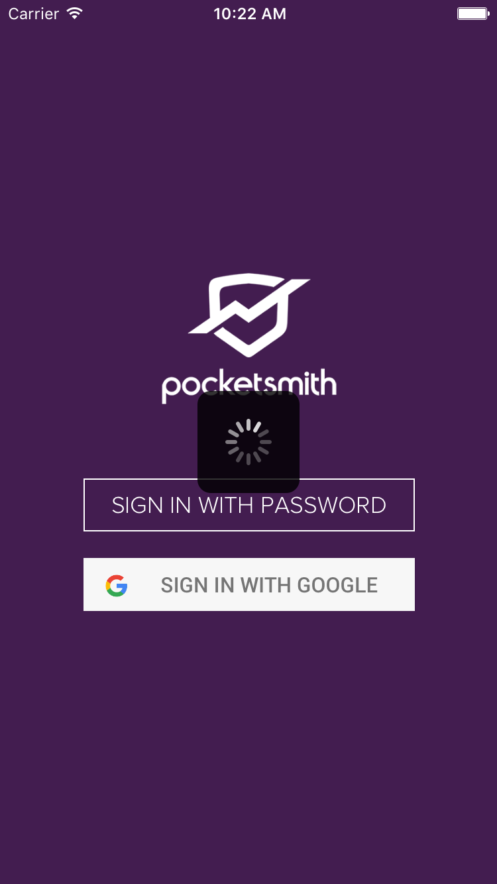
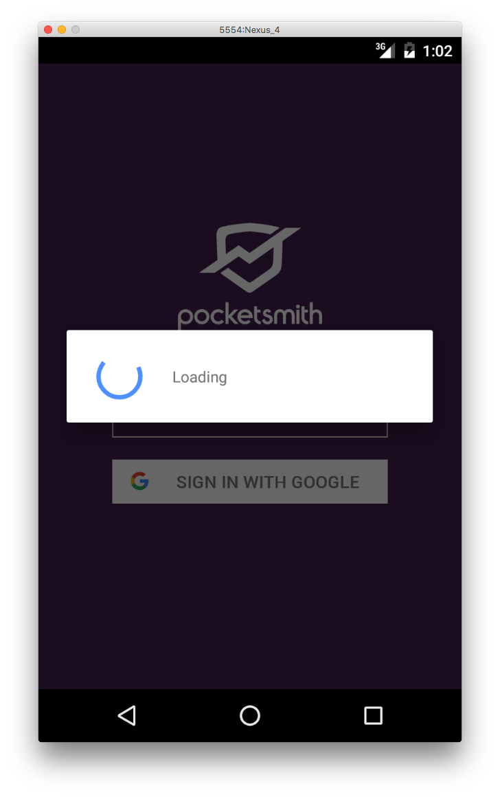

# nativescript-loading-indicator

**nativescript-loading-indicator** is a plugin for NativeScript which overlays a loading indicator on the current page. Can be used, for example, to prevent the UI being interacted with while data is being fetched from an API, while informing the user that something is happening.

Under the hood, we use [MBProgressHUD](https://github.com/jdg/MBProgressHUD) on iOS, and [ProgressDialog](http://developer.android.com/reference/android/app/ProgressDialog.html) on Android.


## Installation

```bash
tns plugin add nativescript-loading-indicator
```

## Example

```js
var loader = require("nativescript-loading-indicator");

loader.show();

// Do whatever it is you want to do while the loader is showing, then

loader.hide();
```

## Screenshots



