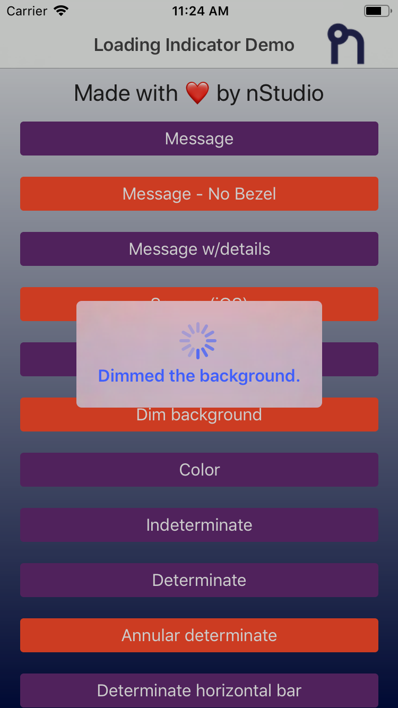
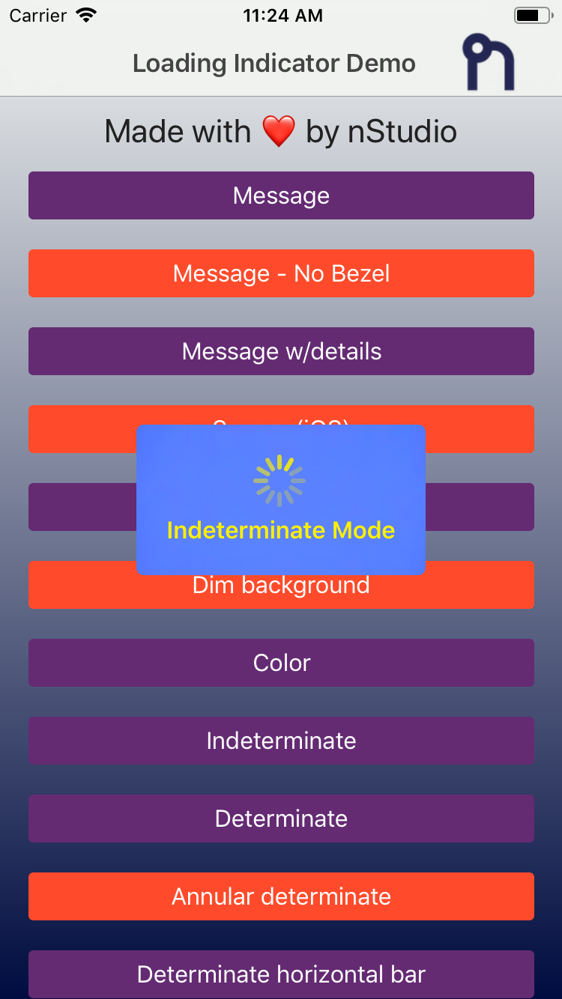
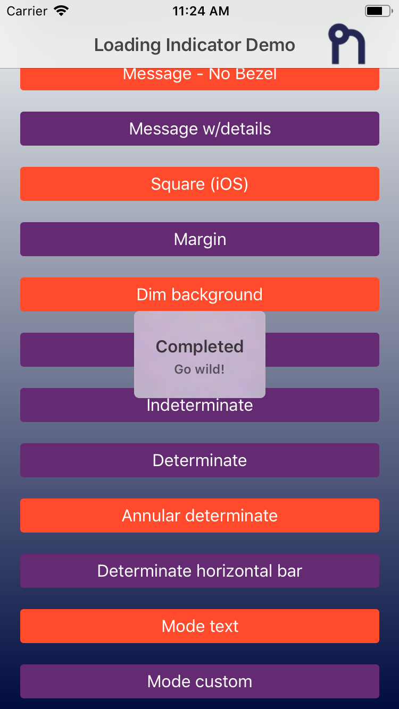
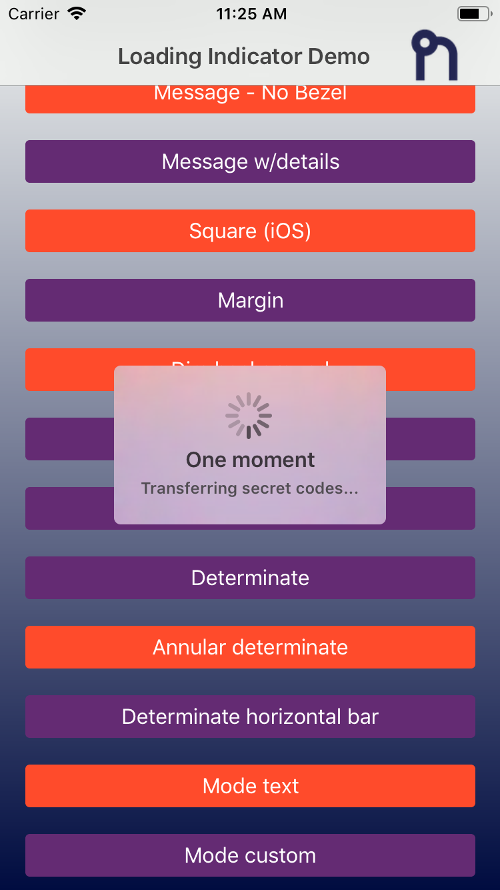
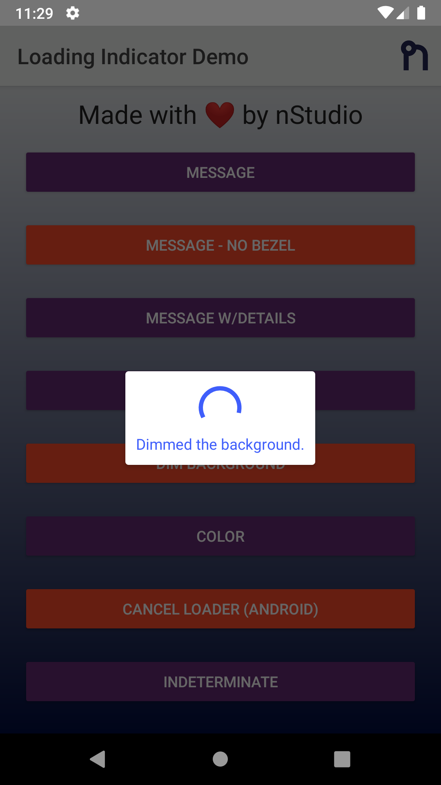
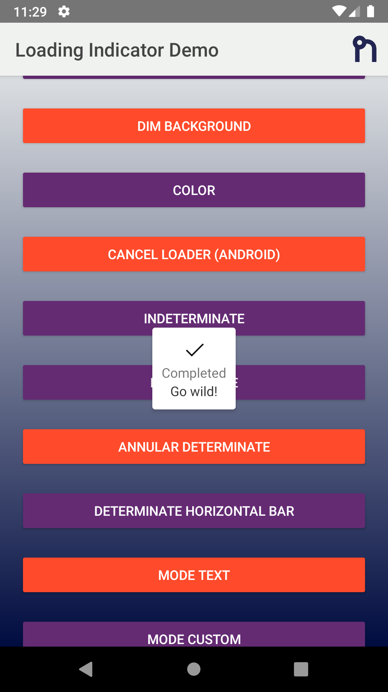
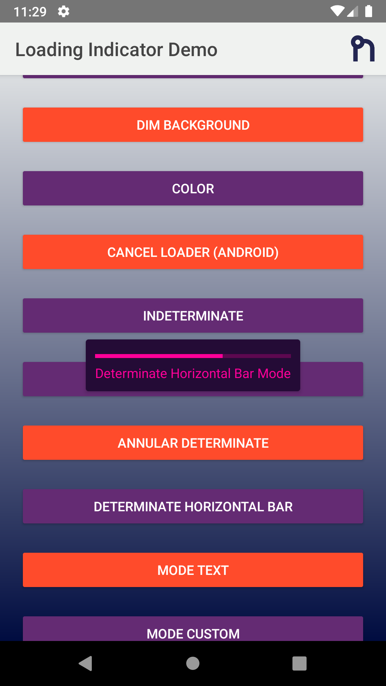
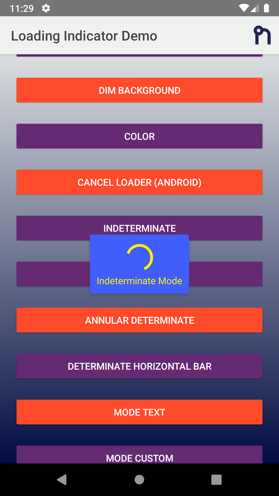

<h1 align="center">** DEPRECATION NOTICE **</h1>

## Package has been deprecated as of July 11th, 2019.

Please use the version published [by nStudio](https://github.com/nstudio/nativescript-loading-indicator).

### Installation:

`tns plugin add @nstudio/nativescript-loading-indicator`

<hr>

<a align="center" href="https://www.npmjs.com/package/nativescript-loading-indicator">
    <h3 align="center">NativeScript Loading Indicator</h3>
</a>
<h4 align="center">
NativeScript-Loading-Indicator is a plugin for NativeScript which overlays a loading indicator on the current page. Can be used, for example, to prevent the UI being interacted with while data is being fetched from an API, while informing the user that something is happening.
</h4>

## Installation

```bash
tns plugin add nativescript-loading-indicator
```

## Screenshots

### iOS

<p align="center">
  
  
  
  
</p>

### Android

<p align="center">
  
  
  
  
</p>

## Example

#### TypeScript

```typescript
import {
  LoadingIndicator,
  Mode,
  OptionsCommon
} from 'nativescript-loading-indicator';

const indicator = new LoadingIndicator();

const options: OptionsCommon = {
  message: 'Loading...',
  details: 'Additional detail note!',
  progress: 0.65,
  margin: 10,
  dimBackground: true,
  color: '#4B9ED6', // color of indicator and labels
  // background box around indicator
  // hideBezel will override this if true
  backgroundColor: 'yellow',
  userInteractionEnabled: false, // default true. Set false so that the touches will fall through it.
  hideBezel: true, // default false, can hide the surrounding bezel
  mode: Mode.AnnularDeterminate, // see options below
  android: {
    view: someStackLayout.android, // Target view to show on top of (Defaults to entire window)
    cancelable: true,
    cancelListener: function(dialog) {
      console.log('Loading cancelled');
    }
  },
  ios: {
    view: someButton.ios, // Target view to show on top of (Defaults to entire window)
    square: false
  }
};

indicator.show(options);

// after some async event maybe or a timeout hide the indicator
indicator.hide();
```

#### javascript

```js
const LoadingIndicator = require('nativescript-loading-indicator')
  .LoadingIndicator;
const Mode = require('nativescript-loading-indicator').Mode;

const loader = new LoadingIndicator();

// optional options
// android and ios have some platform specific options
const options = {
  message: 'Loading...',
  details: 'Additional detail note!',
  progress: 0.65,
  margin: 10,
  dimBackground: true,
  color: '#4B9ED6', // color of indicator and labels
  // background box around indicator
  // hideBezel will override this if true
  backgroundColor: 'yellow',
  userInteractionEnabled: false, // default true. Set false so that the touches will fall through it.
  hideBezel: true, // default false, can hide the surrounding bezel
  mode: Mode.AnnularDeterminate, // see options below
  android: {
    view: android.view.View, // Target view to show on top of (Defaults to entire window)
    cancelable: true,
    cancelListener: function(dialog) {
      console.log('Loading cancelled');
    }
  },
  ios: {
    view: UIView // Target view to show on top of (Defaults to entire window)
  }
};

loader.show(options); // options is optional

// Do whatever it is you want to do while the loader is showing, then

loader.hide();
```

### Common Options

```typescript
export interface OptionsCommon {
  /**
   * Message in the loading indicator.
   */
  message?: string;

  /**
   * Details message in the loading indicator.
   */
  details?: string;

  /**
   * Color of the message text.
   */
  color?: string;

  /**
   * Background color of the loading indicator.
   */
  backgroundColor?: string;

  /**
   * Progress of the indicator when not using CustomView or Text Mode.
   */
  progress?: number;

  /**
   * Margin for the message/indicator to the edge of the bezel.
   */
  margin?: number;

  /**
   * Set true to allow user interaction.
   */
  userInteractionEnabled?: boolean;

  /**
   * Dim the background behind the indicator.
   */
  dimBackground?: boolean;

  /**
   * Hide bezel around indicator
   */
  hideBezel?: boolean;

  /**
   * The mode of the loading indicator.
   */
  mode?: Mode;

  /**
   * If `mode` is set to CustomView, then you can pass an image or view to show in the loading indicator.
   */
  customView?: any;

  /**
   * iOS specific configuration options.
   */
  ios?: OptionsIOS;

  /**
   * Android specific configuration options.
   */
  android?: OptionsAndroid;
}
```

#### Android Specific

```typescript
export interface OptionsAndroid {
  /**
   * Native View instance to anchor the loading indicator to.
   */
  view?: android.view.View;
  max?: number;
  progressNumberFormat?: string;
  progressPercentFormat?: number;
  progressStyle?: number;
  secondaryProgress?: number;
  cancelable?: boolean;
  cancelListener?: (dialog: any) => void;
  elevation?: number;
}
```

#### iOS Specific

```typescript
export interface OptionsIOS {
  /**
   * Native View instance to anchor the loading indicator to.
   */
  view?: UIView;
  square?: boolean;
}
```

### Mode Enum

```typescript
export enum Mode {
  Indeterminate = 0,
  Determinate = 1,
  DeterminateHorizontalBar = 2,
  AnnularDeterminate = 3,
  CustomView = 4,
  Text = 5
}
```
